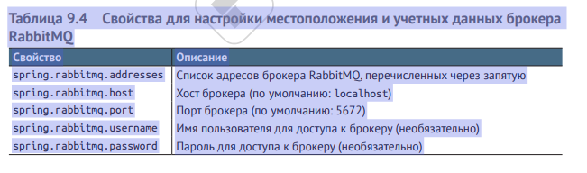

Добавление  начальной  зависимости  AMQP  в  спецификацию
сборки  запустит  механизм  автоконфигурации,  который  создаст
фабрику соединений AMQP, компоненты RabbitTemplate и  другие
вспомогательные компоненты. Простого добавления этой зависи-
мости вполне достаточно, чтобы получить возможность отправлять
и  получать сообщения через брокера RabbitMQ с  помощью Spring. 

------------------------------------------
spring.rabbitmq.addresses | Список адресов брокера RabbitMQ, перечисленных через запятую
spring.rabbitmq.host  | Хост брокера (по умолчанию: localhost)
spring.rabbitmq.port   | Порт брокера (по умолчанию: 5672)
spring.rabbitmq.username| Имя пользователя для доступа к брокеру (необязательно)
spring.rabbitmq.password | Пароль для доступа к брокеру (необязательно)
